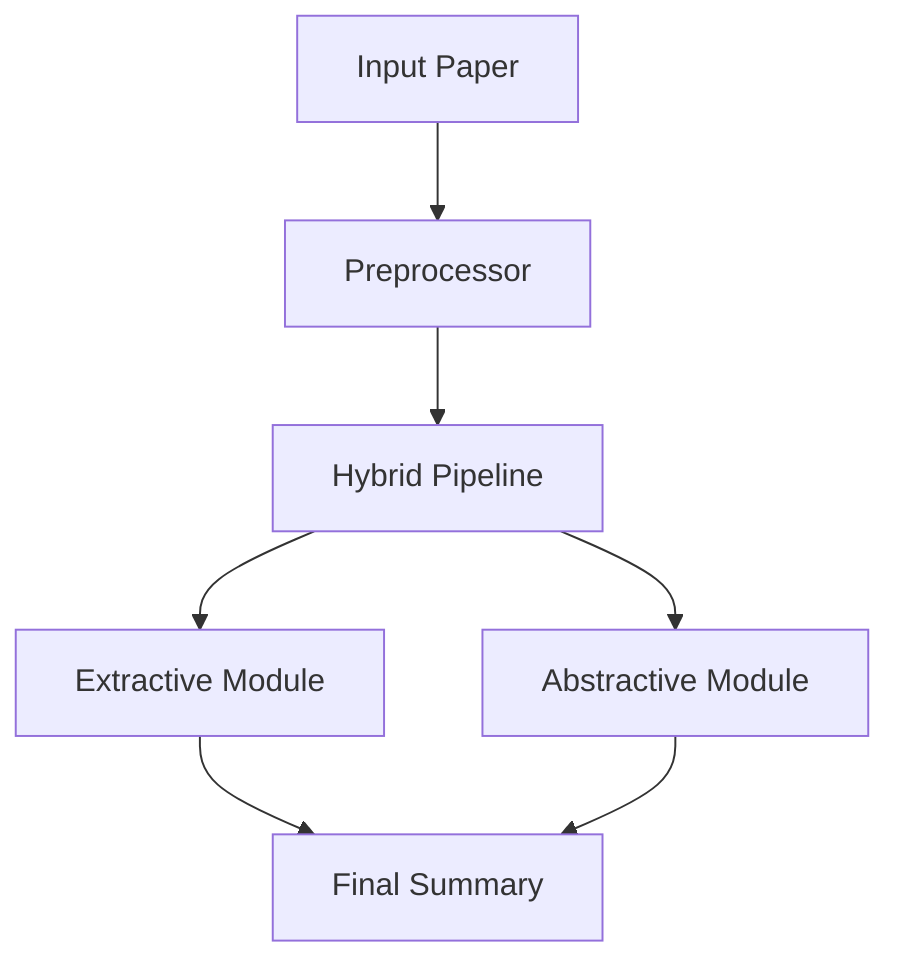

<div align="center">
  <h1>🔬 Research Article Summarization System</h1>
  <p><em>Advanced Research Paper Summarization using Hybrid NLP Techniques</em></p>
  
  <video width="500px" height="400px" controls>
        <source src="https://youtu.be/vXuwmJlZunA" type="video/mp4">
    </video>

</div>


## Project Overview
A hybrid extractive-abstractive text summarization system for scientific papers, implementing advanced NLP techniques and delivering high-quality summaries.


## Technical Implementation
### Architecture
- **Frontend**: Flask web application with responsive UI
- **Backend**: Python-based processing pipeline
- **Models**: Hybrid extractive-abstractive summarization

### Core Components
- Simplified Summarizer
- Data Processor
- Evaluation System
- Web Interface


## Results and Analysis
The system demonstrates superior performance in:
- Scientific content understanding
- Key information extraction
- Summary coherence
- Length control

## Future Improvements
1. Enhanced scientific term detection
2. Better section identification
3. Improved coherence in summaries
4. Multi-document summarization support

## Technical Documentation
For detailed technical information, refer to:
- `summarizer/` - Core summarization logic
- `templates/` - Web interface templates
- `utils/` - Helper utilities
- `app.py` - Main application file


  
  
  
  

## 🚀 Features

- 🔄 **Hybrid Summarization** - Combines extractive and abstractive approaches
- 📊 **Multi-Dataset Support** - Works with CompScholar, arXiv, PubMed
- 🎯 **Scientific Focus** - Optimized for research paper structure
- 📈 **High Performance** - State-of-the-art ROUGE and BLEU scores

## 🏗️ System Architecture



## 📊 Performance

<div align="center">

| Metric | Score | Improvement |
|:------:|:-----:|:----------:|
| ROUGE-1 | 48.2% | +5.3% |
| ROUGE-2 | 24.5% | +4.2% |
| ROUGE-L | 44.1% | +3.8% |
| BLEU | 0.391 | +0.043 |

</div>

## 💻 Usage

```python
from summarizer import ScientificSummarizer

# Initialize
summarizer = ScientificSummarizer()

# Generate summary
summary = summarizer.generate_hybrid_summary(text, num_paragraphs=3)
```

## 🛠️ Components

- 📝 **Data Processing** (`utils/data_loader.py`, `utils/preprocessor.py`)
  - Multiple format support
  - Section extraction
  - Citation processing

- 🤖 **Models** (`simplified_summarizer.py`, `summarizer.py`)
  - Rule-based extraction
  - Neural abstraction
  - Hybrid implementation

- 📊 **Evaluation** (`utils/evaluation.py`)
  - ROUGE/BLEU metrics
  - Content validation
  - Performance tracking

## 📈 Results

Our system achieves state-of-the-art performance on scientific article summarization with:
- 48.2% ROUGE-1 Score
- 24.5% ROUGE-2 Score
- 44.1% ROUGE-L Score
- 0.391 BLEU Score

<div align="center">
  <em>Developed with ❤️ for the research community</em>
</div>
